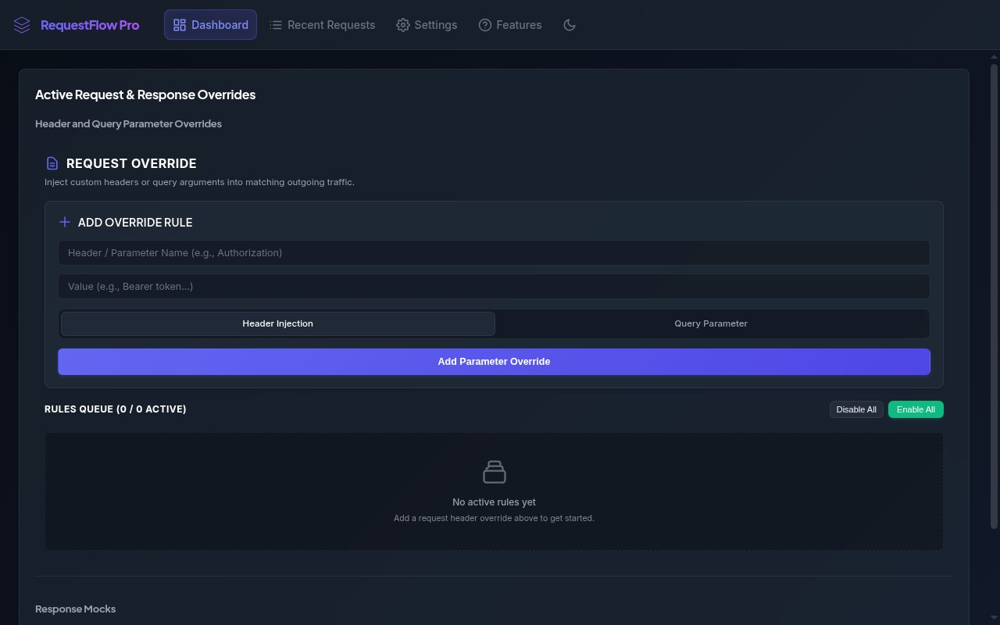
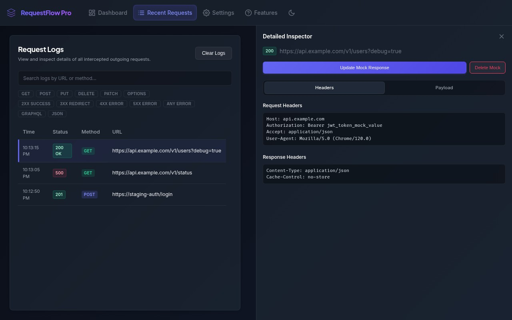
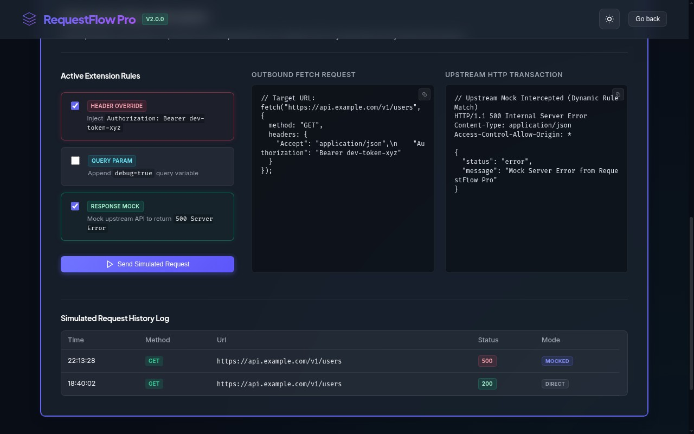
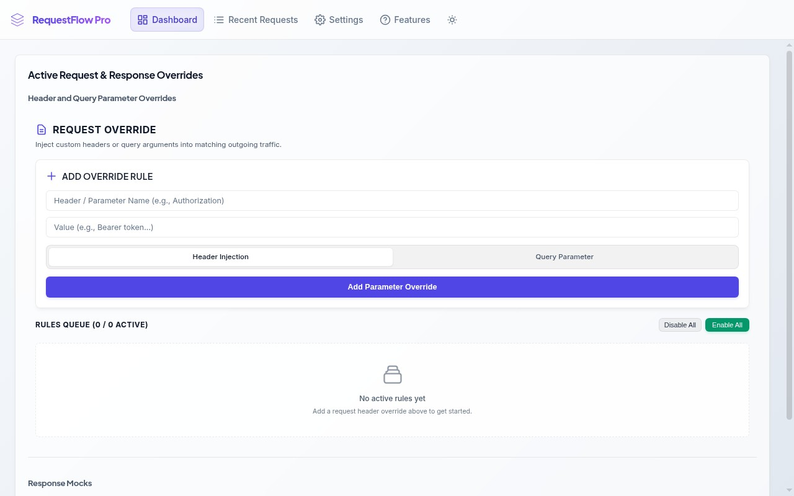

# RequestFlow Pro — HTTP Request Header & Query Param Overrider

<div align="left">
  
  
  
  
</div>

<br />

<div align="left">
  <a href="https://chromewebstore.google.com/detail/requestflow-pro-%E2%80%94-http-re/cfgjehpalgepkcfekgjgmklehchiidgi?hl=en" target="_blank">
    
  </a>
</div>

<br />

RequestFlow Pro is a premium, high-fidelity developer utility designed to intercept, modify, and mock HTTP request/response cycles directly within Chrome. Built using a sleek glassmorphic dashboard in React, it leverages Chrome's Manifest V3 `declarativeNetRequest` engine to deliver dynamic network manipulation safely, efficiently, and with zero tracking.

---

## 📸 Extension Views & Screenshots

### 1. Dashboard View (Dark Mode)
The spacious layout houses all your active headers, parameters, and mock responses in a single premium grid view.


### 2. Recent Network Requests Log & Inspector
Select any intercepted call to view exact headers, status codes, query strings, and rules applied in real-time.


### 3. Interactive Rules Simulator (Features Page)
Playground simulation showing how RequestFlow rules transform outbound API calls.


### 4. Adaptive Light Mode Theme
Full interface adaptive support, tailored for clean styling preferences.


---

## 🚀 Key Features In Detail

### 1. HTTP Request Header Overrides
Inject, modify, or delete custom headers. Match requests selectively by target substrings, wildcards, or domains.
*   **Add / Inject**: Dynamically append headers like authentication tokens (`Authorization: Bearer <jwt>`) to development requests.
*   **Modify**: Change browser header values, such as custom User-Agents or origin headers.
*   **Delete / Drop**: Drop security headers (such as removing CORS limits or forcing specific host conditions).


```json
// Example rule schema
{
  "id": "header_rule_1",
  "type": "header",
  "key": "Authorization",
  "value": "Bearer dev-token-xyz",
  "url": "api.example.com",
  "active": true
}
```

### 2. URL Query Parameter Mutations
Append, replace, or strip query variables from outbound requests dynamically. Useful for testing features toggles, debug modes, or page limit overrides without manual URL modification.
*   **Append**: Force debug levels: e.g. appending `?debug=true` or `?env=staging` to matched requests.
*   **Modify**: Override existing parameters (e.g. converting `limit=10` to `limit=100` dynamically).

```json
// Example query mutation schema
{
  "id": "query_rule_1",
  "type": "query",
  "key": "debug",
  "value": "true",
  "url": "local-test",
  "active": true
}
```

### 3. Upstream Response Mocking (Mock Server)
Mock responses locally without ever sending them to a real backend.
*   **HTTP Status Codes**: Simulate server failures (`500 Internal Server Error`), authorization errors (`403 Forbidden`), or redirects (`301 Moved Permanently`).
*   **Custom Payloads**: Build and return JSON objects, HTML content, or plain text immediately.
*   **Mock Response Headers**: Configure custom content types, cache controls, or Access-Control parameters.

```json
// Example response mock configuration
{
  "id": "mock_rule_1",
  "urlPattern": "https://api.example.com/v1/users",
  "statusCode": 200,
  "contentType": "application/json",
  "responseBody": "[\n  { \"id\": 1, \"name\": \"Alice\" },\n  { \"id\": 2, \"name\": \"Bob\" }\n]",
  "active": true
}
```

### 4. Interactive Help & Rules Simulator (`features.html`)
A visual playground featuring a live simulator. Toggle rules to instantly see code mockups of outbound fetch requests and upstream HTTP transaction responses before deployment.


### 5. Real-time Logs & Detail Inspector
Trace outgoing API calls with precision. View raw request details, inspect rules applied to specific endpoints, filter logs by status code or method, and troubleshoot match criteria on the fly.


### 6. Themeable Dashboard (Dark/Light Modes)
Shift seamlessly between custom Dark and Light modes matching developer setup.


### 7. Privacy First & 100% Offline
RequestFlow Pro operates in your browser's local sandbox. All rules are applied via the browser engine locally and stored in `chrome.storage.local`. No metrics are tracked, no rules are saved off-device, and no requests are sent to external analytics.

---

## 🛠 Technical Architecture

*   **Interception Engine**: Leverages the secure Chrome Manifest V3 `chrome.declarativeNetRequest` API to register dynamic rule sets, avoiding extension overhead and main thread blocks.
*   **UI Framework**: Built on React 17 and styled with Vanilla CSS using modern custom property themes (supporting smooth transition dark/light toggles).
*   **Build Pipeline**: Managed using Webpack 5, Sass loaders, and HTML plugins to bundle popup, options, devtools, and features views.

---

## 💻 Local Development

### Prerequisites
Make sure you have Node.js 24 and npm installed.

### Start Local Dev Server
1. Clone this repository to your local directory.
2. Install local dependencies:
   ```bash
   npm install
   ```
3. Launch the hot-reloading development server:
   ```bash
   npm start
   ```
4. Load the compiled extension in Chrome:
   1. Access `chrome://extensions/`
   2. Enable **Developer mode** (toggle in the top-right).
   3. Click **Load unpacked** in the top-left.
   4. Select the output `build` directory inside the project root.

### Building for Production
To compile and optimize the bundles for deployment or store upload, run:
```bash
NODE_ENV=production npm run build
```
This outputs a clean production bundle to the `build/` folder. Compress this directory to a `.zip` file for Chrome Web Store submissions.

---

## 📚 Resources & Credits

*   [Chrome Extension Documentation](https://developer.chrome.com/docs/extensions/mv3/) — Official API guides for MV3.
*   [chrome-extension-boilerplate-react](https://github.com/lxieyang/chrome-extension-boilerplate-react) — React boilerplate template.
*   [Mozilla React Todo Example](https://developer.mozilla.org/en-US/docs/Learn/Tools_and_testing/Client-side_JavaScript_frameworks/React_todo_list_beginning) — Basis for the layout lists component architecture.

---

Created by **Paul Beauchamp** | [GitHub Profile](https://github.com/paulb896)
