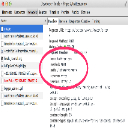

# HTTP Request Header Overrides Chrome Extension

## Local Development

### Start Local Server

1. Run `npm install` to install the dependencies.
1. Run `npm start`
1. Load your extension on Chrome following:
   1. Access `chrome://extensions/`
   1. Check `Developer mode`
   1. Click on `Load unpacked extension`
   1. Select the `build` folder.

## Packing

After the development of your extension run the command

```
$ NODE_ENV=production npm run build
```

Now, the content of `build` folder will be the extension ready to be submitted to the Chrome Web Store. Just take a look at the [official guide](https://developer.chrome.com/webstore/publish) to more infos about publishing.

## Resources:

|  Source  |      Description      |
|----------|-----------------------|
| [chrome-extension-boilerplate-react](https://github.com/lxieyang/chrome-extension-boilerplate-react) | A React Chrome Extension Boilerplate template used for the http request header override extension project |
| [Chrome Extension documentation](https://developer.chrome.com/extensions/getstarted) | Main Google Docs for developing Chrome Extensions |
| [Mozilla Todo React App Example](https://developer.mozilla.org/en-US/docs/Learn/Tools_and_testing/Client-side_JavaScript_frameworks/React_todo_list_beginning) | Used as a basis for the [request header react app](src/pages/Popup/components/RequestHeadersApp.jsx) |

---

Paul Beauchamp | [Website](https://github.com/paulb896)
